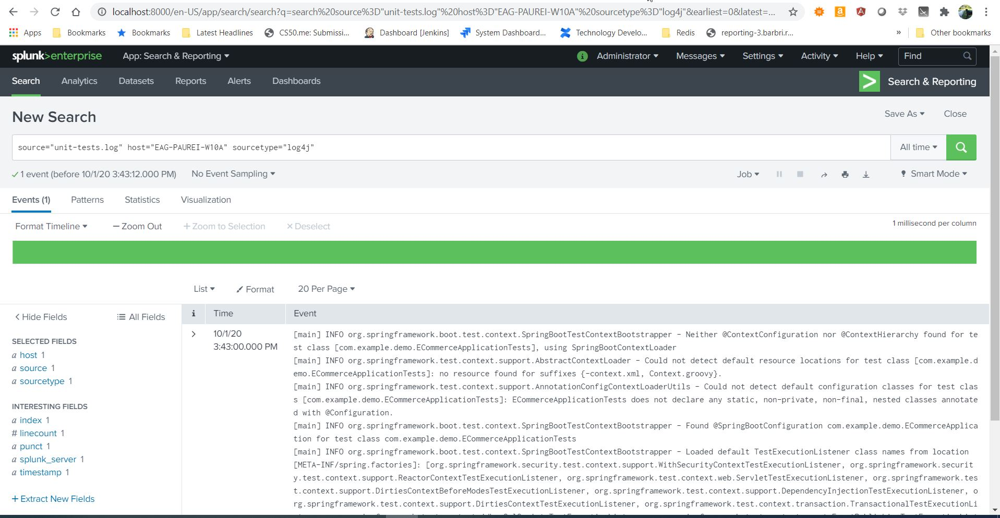

# eCommerce Application

In this project, I had the opportunity to demonstrate the security and DevOps skills that I learned in this lesson by completing an eCommerce application. I started with a template for the complete application, and my goal was to take this template and add proper authentication and authorization controls so users can only access their data, and that data can only be accessed in a secure way. 

## Project Template
First, I got set up with the template. The template was written in Java using Spring Boot, Hibernate ORM, and the H2 database. H2 is an in memory database, so if I needed to retry something, every application startup was a fresh copy.

In the project, you will see 5 packages:

* demo - this package contains the main method which runs the application

* model.persistence - this package contains the data models that Hibernate persists to H2. There are 4 models: Cart, for holding a User's items; Item , for defining new items; User, to hold user account information; and UserOrder, to hold information about submitted orders. Looking back at the application “demo” class, you'll see the `@EntityScan` annotation, telling Spring that this package contains our data models

* model.persistence.repositories - these contain a `JpaRepository` interface for each of our models. This allows Hibernate to connect them with our database so we can access data in the code, as well as define certain convenience methods. Looking at the application “demo” class, you’ll see the `@EnableJpaRepositories` annotation, telling Spring that this package contains our data repositories.

* model.requests - this package contains the request models. The request models are transformed by Jackson from JSON to these models as requests are made. Note the `Json` annotations, telling Jackson to include and ignore certain fields of the requests. You can also see these annotations on the models themselves.

* controllers - these contain the api endpoints for our app, 1 per model. Note they all have the `@RestController` annotation to allow Spring to understand that they are a part of a REST API

In resources, you'll see the application configuration that sets up our database and Hibernate, It also contains a data.sql file with a couple of items to populate the database with. Spring runs this file every time the application starts

Once the application is started, using a REST client, such as Postman, one can explore the APIs.

Some examples are as below:
To create a new user for example, you would send a POST request to:
http://localhost:8080/api/user/create with an example body like 

```
{
    "username": "test"
}
```


and this would return
```
{
    "id" 1,
    "username": "test"
}
```


## Authentication and Authorization
We needed to add proper authentication and authorization controls so users can only access their data, and that data can only be accessed in a secure way. I did this using a combination of usernames and passwords for authentication, as well as JSON Web Tokens (JWT) to handle the authorization.

As stated prior, I implemented a password based authentication scheme. To do this, I needed to store the users' passwords in a secure way. This was done with hashing, and it's this hash which is stored. Additionally when viewing their user information, the user's hash is not returned to them in the response, I also added some requirements and validation, as well as a confirm field in the request, to make sure they didn't make a typo. 

1. Added spring security dependencies: 
   * Spring-boot-starter-security
1. JWT does not ship as a part of spring security, so I had to add the 
   * java-jwt dependency to your project. 
1. Spring Boot ships with an automatically configured security module that must be disabled, as I implemented my own. This was done in the Application class.
2. Create password for the user
3. Once that was disabled, I implemented 4 classes:
   * a subclass of `UsernamePasswordAuthenticationFilter` for taking the username and password from a login request and logging in. This, upon successful authentication, hands back a valid JWT in the `Authorization` header
   * a subclass of `BasicAuthenticationFilter`. 
   * an implementation of the `UserDetailsService` interface. This takes a username and returns a userdetails User instance with the user's username and hashed password.
   *  a subclass of `WebSecurityConfigurerAdapter`. This attachs my user details service implementation to Spring's `AuthenticationManager`. It also handles session management and what endpoints are secured. For us, we manage the session so session management should be disabled. My filters were added to the authentication chain and every endpoint but 1 had security required. The one that should not is the one responsible for creating new users.


You can use Spring's default /login endpoint to login like so

```
POST /login 
{
    "username": "test",
    "password": "somepassword"
}
```

and that will, if those are valid credentials, return a 200 OK with an Authorization header which looks like "Bearer <data>" this "Bearer <data>" is a JWT and must be sent as a Authorization header for all other rqeuests. If it's not present, endpoints return 401 Unauthorized. If it's present and valid, the endpoints function as normal.

## Testing
I implemented unit tests demonstrating at least 93% class coverage, 91% method coverage, and 80% line coverage.

## Splunk

Some Splunk screen-shots:




## Jenkins

A Jenkins screen-shot:

